# ERP Finance Architecture Specification

**Document:** ERP-FINANCE-ARCHITECTURE.md  
**Version:** 1.0.0  
**Status:** Architecture Baseline  
**Platform:** Laravel ERP  
**Primary Module:** Finance & Accounting  
**Architecture Type:** Modular, Multi-Company, Enterprise ERP  
**Database:** MySQL 8+ / MariaDB  
**Backend:** Laravel + PHP 8.3+  
**Frontend:** Blade + Livewire  
**API:** REST API v1  

---

# 1. Purpose

This document defines the architecture, database design, accounting rules, module boundaries, workflows, security requirements, and development standards for a scalable ERP system built with Laravel.

The ERP will initially implement the **Finance & Accounting module**.

The architecture must support the future addition of:

- Human Resources
- Payroll
- Procurement
- Inventory
- Sales
- Customer Management
- Supplier Management
- Fixed Assets
- Budget Management
- Project Management
- Production
- Maintenance
- Document Management
- Compliance
- Reporting & BI
- Workflow Management

The Finance module must therefore be designed as an independent but highly reusable ERP module.

---

# 2. Architectural Principles

The following principles are mandatory.

## 2.1 Accounting Integrity

Financial correctness takes priority over UI convenience.

Every financial transaction must follow double-entry accounting.

```text
Total Debit = Total Credit
```

### 2.2 Modular Architecture
Modules must have clearly defined boundaries.
ERP Core
   |
   +-- Finance
   |
   +-- HR
   |
   +-- Payroll
   |
   +-- Procurement
   |
   +-- Inventory
   |
   +-- Sales
   |
   +-- Fixed Assets
   |
   +-- Reporting
Future modules should integrate through:
- Services
- Events
- Listeners
- APIs
- Integration contracts
Direct database manipulation between modules should be avoided.
### 2.3 Multi-Company

The system must support multiple companies/entities.

Financial data must be isolated by company.

A user assigned to Company A must not automatically access Company B.

### ### 2.4 Auditability
Important ERP and financial operations must be traceable.
Examples:
- Who created the transaction?
- Who modified it?
- Who approved it?
- Who posted it?
- When was it posted?
- Was it reversed?
- What was the original value?
### 2.5 No Deletion of Posted Transactions
Posted financial transactions must never be physically deleted.
Correction must be performed through:
Original Journal
      |
      v
Reversal Journal
      |
      v
Correct Journal
### 2.6 Configuration Over Hard Coding
Do not hard-code:
- Account IDs
- Tax rates
- Approval limits
- Fiscal periods
- Company settings
- Currency rules
- Document numbering
These must be configurable.
3. High-Level Architecture
                         ERP PLATFORM
                              |
             +----------------+----------------+
             |                |                |
          ERP CORE          FINANCE         WORKFLOW
             |                |                |
             |        +-------+--------+       |
             |        |       |        |       |
             |       GL      AP       AR      |
             |        |       |        |       |
             |     Cash/Bank Tax    Budget    |
             |                |                |
             +----------------+----------------+
                              |
                       INTEGRATION LAYER
                              |
       +----------+-----------+-----------+-----------+
       |          |           |           |           |
      HR       Payroll   Procurement    Sales     Inventory
       |          |           |           |           |
       +----------+-----------+-----------+-----------+
                              |
                          FINANCE
4. Technology Stack
Backend
- PHP 8.3+
- Laravel
- Laravel Eloquent
- Laravel Queues
- Laravel Events
- Laravel Notifications
- Laravel Scheduler
- Laravel Policies
- Laravel Form Requests
- Laravel API Resources
Frontend
Preferred:
- Laravel Blade
- Livewire
- Alpine.js
- Bootstrap or Tailwind CSS
The UI framework should remain replaceable.
Database
Primary:
- MySQL 8+
- MariaDB
Use:
DECIMAL(20,4)
for monetary values.
Never use:
FLOAT
DOUBLE
for accounting amounts.
5. ERP Core
The Core module contains functionality shared by all ERP modules.
Core Components
Core
├── Companies
├── Branches
├── Departments
├── Divisions
├── Business Units
├── Locations
├── Users
├── Roles
├── Permissions
├── Fiscal Years
├── Fiscal Periods
├── Currencies
├── Exchange Rates
├── Workflows
├── Approvals
├── Notifications
├── Attachments
├── Audit Logs
├── Number Sequences
└── System Settings
6. Multi-Company Architecture
6.1 Company
Table:
companies
Recommended fields:
Field	Type	Required
id	BIGINT	Yes
code	VARCHAR(50)	Yes
name	VARCHAR(255)	Yes
legal_name	VARCHAR(255)	No
address	TEXT	No
phone	VARCHAR(50)	No
email	VARCHAR(255)	No
tax_number	VARCHAR(100)	No
registration_number	VARCHAR(100)	No
base_currency_id	BIGINT	Yes
timezone	VARCHAR(100)	Yes
fiscal_year_start	DATE	No
status	VARCHAR(30)	Yes
created_by	BIGINT	No
updated_by	BIGINT	No
created_at	TIMESTAMP	Yes
updated_at	TIMESTAMP	Yes


7. Organizational Structure
The ERP must support:
Company
   |
   +-- Branch
   |
   +-- Business Unit
   |
   +-- Division
   |
   +-- Department
   |
   +-- Location
   |
   +-- Cost Center
   |
   +-- Profit Center
Recommended tables:
branches
business_units
divisions
departments
locations
cost_centers
profit_centers
8. Company Context
Create a reusable:
CompanyContext
responsibility:
- Determine active company
- Validate company access
- Apply company scope
- Prevent cross-company access
All financial queries must be company-aware.
9. Fiscal Year
Table:
fiscal_years
Fields:
id
company_id
name
start_date
end_date
status
is_current
created_by
updated_by
created_at
updated_at
Statuses:
OPEN
CLOSED
LOCKED
10. Fiscal Period
Table:
fiscal_periods
Fields:
id
fiscal_year_id
period_name
period_number
start_date
end_date
status
closed_at
closed_by
created_at
updated_at
Statuses:
OPEN
CLOSING
CLOSED
LOCKED
11. Accounting Period Rules
Before posting any transaction:
1. Identify fiscal period.
2. Confirm period exists.
3. Confirm period belongs to the company.
4. Confirm period is open.
5. Confirm transaction date falls inside the period.
6. Reject posting if period is closed.
7. Log period reopening.
Central service:
AccountingPeriodService
12. Currency Management
Tables:
currencies
exchange_rates
Currency
Fields:
id
code
name
symbol
decimal_places
status
Example:
BDT
USD
EUR
GBP
13. Exchange Rate
Table:
exchange_rates
Fields:
id
company_id
currency_id
rate_date
exchange_rate
source
status
created_by
created_at
updated_at
Historical transactions must store their exchange rate.
Never recalculate historical transactions using the current exchange rate.
14. Chart of Accounts
The Chart of Accounts is the foundation of Finance.
Table:
accounts
Fields:
id
company_id
parent_id
account_code
account_name
account_type
account_category
normal_balance
level
is_group
is_postable
currency_id
status
description
created_by
updated_by
created_at
updated_at
15. Account Types
Supported account types:
ASSET
LIABILITY
EQUITY
REVENUE
EXPENSE

16. Account Hierarchy
Example:
1000 Assets
|
+-- 1100 Current Assets
|   |
|   +-- 1110 Cash
|   +-- 1120 Bank
|   +-- 1130 Accounts Receivable
|
+-- 1200 Fixed Assets

2000 Liabilities
|
+-- 2100 Current Liabilities
|   |
|   +-- 2110 Accounts Payable
|   +-- 2120 Tax Payable
|
3000 Equity

4000 Revenue

5000 Expenses
|
+-- 5100 Salary Expense
+-- 5200 Rent Expense
+-- 5300 Utilities
17. Account Rules
Group Account
A group account:
is_group = true
cannot receive journal postings.
Postable Account
Only:
is_postable = true
accounts may be used in journal lines.
Inactive Account
Inactive accounts cannot receive new postings.
18. Double-Entry Accounting Engine
The accounting engine is the most critical Finance component.
Every accounting transaction must contain at least two journal lines.
Example:
Rent Payment

Debit:
Rent Expense       100,000

Credit:
Bank               100,000
Rule:
Total Debit = Total Credit
19. Journal Header
Table:
journals
Fields:
id
company_id
journal_number
journal_date
posting_date
fiscal_period_id
reference_type
reference_id
description
status
currency_id
exchange_rate
total_debit
total_credit
posted_at
posted_by
created_by
updated_by
created_at
updated_at
Statuses:
DRAFT
SUBMITTED
APPROVED
POSTED
REJECTED
CANCELLED
REVERSED
20. Journal Lines
Table:
journal_lines
Fields:
id
journal_id
account_id
description
debit
credit
currency_debit
currency_credit
cost_center_id
department_id
branch_id
business_unit_id
project_id
tax_id
reference
created_at
updated_at

21. Journal Validation
Every journal must satisfy:
debit >= 0
credit >= 0

A line cannot have:
debit > 0
AND
credit > 0

A line cannot have:
debit = 0
AND
credit = 0

Journal requirements:
minimum 2 lines

and:
SUM(debit) = SUM(credit)

22. Journal Lifecycle
DRAFT
   |
   v
SUBMITTED
   |
   v
APPROVED
   |
   v
POSTED

Alternative:
SUBMITTED
   |
   +--> REJECTED

Cancellation:
DRAFT
   |
   v
CANCELLED

Correction:
POSTED
   |
   v
REVERSED

23. Journal Service
Create:
JournalService

Responsibilities:
- Validate journal
- Validate accounts
- Validate company
- Validate fiscal period
- Validate debit/credit
- Generate journal number
- Create journal
- Submit journal
- Approve journal
- Post journal
- Reverse journal
- Create audit record
All posting operations must use:
DB::transaction()

24. Posting Engine
The posting engine must:
1. Validate journal.
2. Validate fiscal period.
3. Validate account status.
4. Validate company context.
5. Validate balancing.
6. Lock necessary records when appropriate.
7. Post journal atomically.
8. Record posting timestamp.
9. Record posting user.
10. Create audit trail.
Posting must be idempotent where possible.
A journal must never be posted twice.
25. Reversal
Posted journals cannot be edited.
To correct:
Original Journal
       |
       v
Reversal Journal
       |
       v
Correct Journal
The reversal journal should reference the original journal.
Recommended fields:
reversal_of_journal_id
reversal_reason
reversed_at
reversed_by
26. Document Numbering
Create:
number_sequences
Examples:
JV-2026-000001
JV-2026-000002

PV-2026-000001
RV-2026-000001
BRV-2026-000001
BPV-2026-000001
Document numbering must be configurable per:
- Company
- Document type
- Fiscal year
27. General Ledger
The General Ledger must be based on posted journals.
Users can filter by:
- Company
- Date
- Fiscal year
- Fiscal period
- Account
- Branch
- Department
- Cost center
- Business unit
- Project
- Currency
Display:
Date
Journal Number
Reference
Description
Debit
Credit
Running Balance

Only posted transactions should appear in the official General Ledger.
28. Account Balance
For each account:
Opening Balance
+
Debits
-
Credits
=
Closing Balance
The actual calculation must respect the account's normal balance.
29. Trial Balance
Trial Balance must contain:
Account
Opening Debit
Opening Credit
Period Debit
Period Credit
Closing Debit
Closing Credit
Control rule:
Total Debits = Total Credits
If the Trial Balance does not balance, the system must raise an accounting integrity error.
30. Accounts Payable
Supplier
Table:
suppliers
Fields:
id
company_id
supplier_code
name
contact_person
address
phone
email
tax_number
currency_id
payable_account_id
status
created_by
updated_by
created_at
updated_at
31. Supplier Invoice
Recommended table:
supplier_invoices

Header:
id
company_id
supplier_id
invoice_number
invoice_date
due_date
currency_id
exchange_rate
subtotal
tax_amount
discount_amount
total_amount
outstanding_amount
status
journal_id
created_by
updated_by
created_at
updated_at

Lines:
supplier_invoice_lines

32. Supplier Invoice Accounting
Example:
Debit   Expense / Inventory
Credit  Accounts Payable

Tax may produce:
Debit   Input VAT
Credit  Accounts Payable

depending on the configured tax treatment.
33. Supplier Payments
Table:
supplier_payments

Support:
- Cash payment
- Bank payment
- Partial payment
- Full payment
- Advance payment
- Payment allocation
Accounting:
Debit   Accounts Payable
Credit  Bank/Cash

34. AP Aging
Aging buckets:
Current
1-30 Days
31-60 Days
61-90 Days
91-180 Days
180+ Days

The aging calculation must use invoice due dates.
35. Accounts Receivable
Customer
Table:
customers
Fields:
id
company_id
customer_code
name
contact_person
address
phone
email
tax_number
currency_id
receivable_account_id
status
created_by
updated_by
created_at
updated_at
36. Customer Invoice
Tables:
customer_invoices
customer_invoice_lines
Accounting:
Debit   Accounts Receivable
Credit  Revenue
Tax:
Debit   Accounts Receivable
Credit  Revenue
Credit  Output VAT
37. Customer Receipts
Table:
customer_receipts

Accounting:
Debit   Bank/Cash
Credit  Accounts Receivable

Support:
- Partial receipt
- Full receipt
- Advance receipt
- Receipt allocation
38. AR Aging
Buckets:
Current
1-30 Days
31-60 Days
61-90 Days
91-180 Days
180+ Days

39. Cash Management
Cash accounts must be represented by GL accounts.
Support:
- Cash receipt
- Cash payment
- Cash transfer
- Opening cash balance
- Cash book
- Cash position
40. Bank Management
Table:
bank_accounts
Fields:
id
company_id
bank_name
branch_name
account_name
account_number
currency_id
gl_account_id
opening_balance
status
created_at
updated_at
41. Bank Transactions
Support:
Bank Receipt
Bank Payment
Bank Transfer
Bank Charges
Bank Interest
42. Bank Reconciliation
Table:
bank_reconciliations
Recommended fields:
id
company_id
bank_account_id
statement_date
statement_balance
book_balance
difference
status
reconciled_by
reconciled_at
Reconciliation should allow:
- Matching bank transactions
- Unmatched transaction review
- Bank charges
- Interest
- Adjustments
43. Tax Management
Tables:
taxes
tax_transactions

Tax configuration:
id
company_id
tax_code
tax_name
tax_type
rate
input_account_id
output_account_id
status

Tax types may include:
VAT
WITHHOLDING_TAX
INCOME_TAX
OTHER

Tax rules should be configurable.
44. Cost Centers
Table:
cost_centers

Fields:
id
company_id
parent_id
code
name
manager_id
status

Journal lines may contain:
cost_center_id

This enables:
- Cost center P&L
- Expense analysis
- Budget analysis
- Department analysis
45. Dimensions
The Finance module should support optional accounting dimensions.
Potential dimensions:
Company
Branch
Department
Division
Business Unit
Cost Center
Profit Center
Project
Location
The architecture should allow additional dimensions later.
46. Budget Management
Tables:
budgets
budget_lines
Budget header:
id
company_id
fiscal_year_id
name
status
created_by
updated_by
created_at
updated_at
Budget lines:
id
budget_id
account_id
cost_center_id
period
budget_amount
47. Budget vs Actual
Reports must compare:
Budget
Actual
Variance
Variance %

Example:
Budget Expense       1,000,000
Actual Expense         850,000
Variance               150,000
Variance %                 15%

48. Financial Reports
Minimum required reports:
Accounting
- Journal Register
- General Ledger
- Account Statement
- Trial Balance
Financial Statements
- Profit & Loss
- Balance Sheet
- Cash Flow
AP
- Supplier Statement
- AP Aging
- AP Outstanding
- Payment Register
AR
- Customer Statement
- AR Aging
- AR Outstanding
- Receipt Register
Cash & Bank
- Cash Book
- Bank Book
- Bank Reconciliation
Management
- Budget vs Actual
- Expense Analysis
- Revenue Analysis
- Cost Center Analysis
49. Profit & Loss
Basic structure:
Revenue
    |
    +-- Sales Revenue
    +-- Other Revenue

Less:
Cost of Sales

-------------------------
Gross Profit

Less:
Operating Expenses
    |
    +-- Salary
    +-- Rent
    +-- Utilities
    +-- Administration

-------------------------
Net Profit

50. Balance Sheet
Basic structure:
ASSETS
    Current Assets
    Fixed Assets
    Other Assets

LIABILITIES
    Current Liabilities
    Long-term Liabilities

EQUITY
    Share Capital
    Retained Earnings
    Current Year Profit

Accounting equation:
Assets = Liabilities + Equity

51. Cash Flow
Support:
Operating Activities
Investing Activities
Financing Activities
The architecture should allow both:
- Direct method
- Indirect method
in future versions.
52. Opening Balances
Opening balances must be supported.
Process:
Opening Balance Entry
        |
        v
Account Validation
        |
        v
Balance Validation
        |
        v
Opening Journal
The opening journal must balance.
53. Period Closing
Period closing workflow:
OPEN
 |
 v
CLOSING
 |
 +-- Validate Unposted Journals
 |
 +-- Validate Pending Approvals
 |
 +-- Validate Accounting Errors
 |
 +-- Validate Reconciliation
 |
 v
CLOSED
Only authorized users can reopen a closed period.
Every reopening must be audited.
54. Approval Workflow
Create a reusable workflow engine.
Example:
Expense Voucher
      |
      v
Prepared
      |
      v
Department Approval
      |
      v
Finance Approval
      |
      v
Posted

Approval can be:
- Role based
- User based
- Department based
- Company based
- Amount based
55. Amount-Based Approval
Example:
Amount < 50,000
    -> Manager

50,000 - 500,000
    -> Department Head

> 500,000
    -> CFO

These rules must be configurable.
56. Workflow Tables
Recommended:
workflows
workflow_steps
workflow_instances
workflow_instance_steps
57. Notifications
Use Laravel Notifications.
Support:
Database
Email
Future:
SMS
WhatsApp
Push Notification
Examples:
- Invoice awaiting approval
- Journal awaiting approval
- Payment approved
- Budget exceeded
- Fiscal period closing
- Period closed
58. Queue Jobs
Use Laravel queues for:
- Email
- Notifications
- Excel exports
- PDF reports
- Large report generation
- Scheduled financial summaries
- Integration processing
Jobs must be:
- Retryable
- Logged
- Idempotent where appropriate
59. Audit Trail
Table:
audit_logs

Fields:
id
company_id
user_id
module
entity_type
entity_id
action
old_values
new_values
ip_address
user_agent
created_at

Actions:
CREATE
UPDATE
DELETE
SUBMIT
APPROVE
REJECT
POST
REVERSE
CANCEL
LOGIN
LOGOUT

60. Financial Data Retention
Posted accounting data should be retained according to applicable legal/accounting requirements.
The system should not provide casual deletion functionality for:
- Posted journals
- Posted invoices
- Posted payments
- Posted receipts
- Closed-period records
61. Security Architecture
Implement:
- Authentication
- Authorization
- RBAC
- Policies
- Permissions
- CSRF protection
- XSS protection
- SQL injection protection
- Mass-assignment protection
- Rate limiting
- Secure file upload
- Audit logging
- Session security
62. Permission Model
Suggested roles:
System Administrator
ERP Administrator
Finance Manager
Senior Accountant
Accountant
Finance User
Approver
Auditor
Management
63. Permission Naming
Use granular permissions.
Examples:
finance.view
finance.create
finance.update
finance.delete

journal.view
journal.create
journal.update
journal.submit
journal.approve
journal.post
journal.reverse

ledger.view

supplier.view
supplier.create
supplier.update

supplier_invoice.view
supplier_invoice.create
supplier_invoice.approve
supplier_invoice.post

customer.view
customer.create
customer.update

customer_invoice.view
customer_invoice.create
customer_invoice.approve
customer_invoice.post

payment.view
payment.create
payment.approve
payment.post

receipt.view
receipt.create
receipt.approve
receipt.post

report.view
report.export

period.open
period.close
period.reopen
64. Role Permission Matrix
Function	Admin	Finance Manager	Accountant	Finance User	Auditor
View Finance	Yes	Yes	Yes	Yes	Yes
Create Journal	Yes	Yes	Yes	Yes	No
Approve Journal	Yes	Yes	Limited	No	No
Post Journal	Yes	Yes	Limited	No	No
Reverse Journal	Yes	Yes	No	No	No
View GL	Yes	Yes	Yes	Yes	Yes
Close Period	Yes	Yes	No	No	No
Reopen Period	Yes	Yes	No	No	No
Export Reports	Yes	Yes	Yes	Yes	Yes
Modify COA	Yes	Yes	No	No	No
View Audit Logs	Yes	Yes	Limited	No	Yes


Actual implementation must use permissions rather than role-name checks.
65. API Architecture
API prefix:
/api/v1

Examples:
GET    /api/v1/companies
GET    /api/v1/accounts
POST   /api/v1/accounts
GET    /api/v1/journals
POST   /api/v1/journals
GET    /api/v1/journals/{id}
POST   /api/v1/journals/{id}/submit
POST   /api/v1/journals/{id}/approve
POST   /api/v1/journals/{id}/post
POST   /api/v1/journals/{id}/reverse

Reports:
GET /api/v1/reports/trial-balance
GET /api/v1/reports/general-ledger
GET /api/v1/reports/profit-loss
GET /api/v1/reports/balance-sheet
GET /api/v1/reports/cash-flow
66. API Standards
Use:
- API Resources
- Form Requests
- Authentication
- Pagination
- Filtering
- Sorting
- Validation
- Consistent response structures
- API versioning
Example response:
{
    "success": true,
    "message": "Journal posted successfully.",
    "data": {}
}
67. Integration Architecture
Other ERP modules must not directly manipulate the Finance database.
Integration should follow:
Source Module
      |
      v
Business Event
      |
      v
Integration Listener
      |
      v
Finance Service
      |
      v
Accounting Engine
      |
      v
Journal
      |
      v
General Ledger
68. Procurement Integration
Example:
Purchase Order
      |
      v
Goods Receipt
      |
      v
Supplier Invoice
      |
      v
Approval
      |
      v
Finance Posting
Finance creates:
Debit  Inventory / Expense
Credit Accounts Payable
69. Sales Integration
Example:
Sales Order
      |
      v
Delivery
      |
      v
Customer Invoice
      |
      v
Finance Posting
Finance creates:
Debit  Accounts Receivable
Credit Revenue
70. Payroll Integration
Payroll posting:
Payroll
   |
   v
Payroll Approval
   |
   v
Finance Posting
Possible journal:
Debit  Salary Expense
Debit  Employer Benefits
Credit Salary Payable
Credit Tax Payable
Credit Other Payables
71. Fixed Asset Integration
Asset acquisition:
Fixed Asset
      |
      v
Asset Acquisition
      |
      v
Finance Posting
Example:
Debit  Fixed Asset
Credit Accounts Payable / Bank

Depreciation:
Debit  Depreciation Expense
Credit Accumulated Depreciation

72. ERP Event Naming
Use descriptive events.
Examples:
SupplierInvoiceApproved
CustomerInvoiceApproved
PayrollApproved
AssetAcquired
PaymentApproved
ReceiptApproved
PurchaseInvoicePosted
SalesInvoicePosted

Finance listeners should translate these events into accounting entries.
73. Laravel Project Structure
Recommended:
app/
├── Models/
├── Services/
├── Actions/
├── DTOs/
├── Events/
├── Listeners/
├── Jobs/
├── Notifications/
├── Policies/
├── Rules/
└── Http/
    ├── Controllers/
    ├── Requests/
    └── Resources/

Modules/
├── Core/
└── Finance/
    ├── Models/
    ├── Services/
    ├── Actions/
    ├── Controllers/
    ├── Requests/
    ├── Policies/
    ├── Events/
    ├── Listeners/
    ├── Jobs/
    ├── Notifications/
    ├── Database/
    └── Resources/

database/
├── migrations/
├── seeders/
└── factories/

routes/
├── web.php
└── api.php

resources/
├── views/
└── js/

tests/
├── Unit/
├── Feature/
└── Integration/

74. Service Layer
Important services:
AccountingService
JournalService
LedgerService
AccountingPeriodService
ChartOfAccountsService
CurrencyService
ExchangeRateService
SupplierInvoiceService
CustomerInvoiceService
PaymentService
ReceiptService
BankService
BankReconciliationService
TaxService
BudgetService
FinancialReportService
DocumentNumberService
ApprovalService
AuditService

Controllers must remain thin.
75. Repository Pattern
Repositories may be used where they provide genuine value.
Do not create repositories simply to wrap Eloquent CRUD.
Recommended use:
- Complex financial queries
- Reporting
- Large dataset access
- External data sources
76. DTOs
DTOs may be used for:
- Journal creation
- Journal posting
- Payment posting
- Receipt posting
- Invoice posting
- Report filters
Example:
CreateJournalData
PostJournalData
CreatePaymentData
CreateReceiptData
FinancialReportFilter
77. Database Naming Standards
Use:
snake_case
Examples:
companies
fiscal_years
fiscal_periods
accounts
journal_lines
bank_accounts
cost_centers
audit_logs
Foreign keys:
company_id
account_id
journal_id
supplier_id
customer_id
78. Primary Keys
Use:
BIGINT UNSIGNED

for standard internal IDs unless a strong reason exists to use UUID/ULID.
Public API identifiers may use:
- UUID
- ULID
without exposing sequential database IDs where security or integration requirements justify it.
79. Indexing Strategy
Important indexes:
company_id
account_id
journal_id
fiscal_period_id
journal_date
posting_date
supplier_id
customer_id
cost_center_id
department_id
branch_id
status
Composite indexes should be added based on actual query patterns.
Examples:
(company_id, account_code)
(company_id, journal_date)
(company_id, status)
(company_id, supplier_id)
(company_id, customer_id)
(account_id, journal_id)
80. Foreign Key Strategy
Use foreign keys for financial integrity.
Example:
journal_lines.journal_id
    -> journals.id

journal_lines.account_id
    -> accounts.id

journals.company_id
    -> companies.id
Do not use cascading deletes on posted accounting data.
81. Soft Deletes
Soft deletes may be used for master data:
- Customers
- Suppliers
- Accounts
- Cost centers
Do not use deletion semantics to remove posted accounting transactions.
82. Data Integrity
Database constraints must enforce:
- Required relationships
- Unique codes
- Referential integrity
- Valid company relationships
Application services must enforce:
- Accounting rules
- Workflow rules
- Posting rules
- Period rules
83. Concurrency
Financial posting must account for concurrent users.
Potential problems:
Two users posting the same journal
Two users generating the same document number
Two users closing the same period
Two users modifying the same invoice

Use appropriate:
- Database transactions
- Row locks
- Unique constraints
- Status checks
- Idempotency controls
84. Performance
The system should support millions of journal lines.
Use:
- Proper indexing
- Pagination
- Eager loading
- Query optimization
- Caching
- Queues
- Summary tables where appropriate
Avoid:
N+1 queries

Do not load millions of journal lines into PHP memory for reports.
85. Reporting Architecture
Small reports may execute synchronously.
Large reports should execute through:
Report Request
      |
      v
Queue Job
      |
      v
Report Generation
      |
      v
Stored File
      |
      v
Notification
86. Import Architecture
Support Excel/CSV import for:
Chart of Accounts
Opening Balances
Suppliers
Customers
Bank Accounts
Budgets
Import workflow:
Upload
  |
  v
Validate
  |
  v
Preview
  |
  v
Confirm
  |
  v
Import
Validation errors must be displayed clearly.
87. Import Safety
Imports should support:
- Duplicate detection
- Row validation
- Error reporting
- Transaction rollback
- Import history
Financial imports must never partially corrupt accounting data.
88. Export
Support:
Excel
CSV
PDF
Print

Reports should support:
- Date filters
- Company
- Branch
- Department
- Cost center
- Account
- Currency
89. Dashboard
Finance Dashboard should display:
Total Revenue
Total Expenses
Net Profit
Cash Balance
Bank Balance
Accounts Receivable
Accounts Payable
Outstanding Receivables
Outstanding Payables
Budget Utilization
Charts:
Revenue Trend
Expense Trend
Profit Trend
Cash Flow
Expense by Category
AR Aging
AP Aging
Budget vs Actual
90. Dashboard Security
Dashboard data must respect:
- Company access
- Branch access
- Department access
- Role permissions
- Reporting permissions
A user must never see unauthorized company data through dashboard aggregates.
91. UI/UX Standards
The ERP should have:
- Professional enterprise UI
- Responsive layout
- Sidebar navigation
- Breadcrumbs
- Search
- Filters
- Pagination
- Sorting
- Modal forms
- Confirmation dialogs
- Toast notifications
- Status badges
- Empty states
- Loading states
- Validation messages
92. Finance Menu
Recommended:
Finance
├── Dashboard
├── Chart of Accounts
├── Journals
│   ├── Journal Entry
│   ├── Journal Register
│   └── Recurring Journals
├── General Ledger
├── Accounts Payable
│   ├── Suppliers
│   ├── Supplier Invoices
│   ├── Payments
│   └── AP Aging
├── Accounts Receivable
│   ├── Customers
│   ├── Customer Invoices
│   ├── Receipts
│   └── AR Aging
├── Cash & Bank
│   ├── Cash Accounts
│   ├── Bank Accounts
│   ├── Receipts
│   ├── Payments
│   └── Reconciliation
├── Budget
│   ├── Budgets
│   └── Budget vs Actual
├── Tax
├── Cost Centers
└── Reports
    ├── General Ledger
    ├── Trial Balance
    ├── Profit & Loss
    ├── Balance Sheet
    ├── Cash Flow
    ├── AP Reports
    ├── AR Reports
    └── Management Reports
93. Recurring Journals
Future-ready support should include:
Recurring Journal Template
Recurring Schedule
Next Run Date
Frequency
Amount
Account Lines

Possible frequencies:
Daily
Weekly
Monthly
Quarterly
Yearly

Use Laravel Scheduler + Jobs.
94. Accounting Controls
The system must provide controls for:
Control 1
Total Debits = Total Credits

Control 2
Posted journal cannot be edited

Control 3
Posted journal cannot be deleted

Control 4
Closed period cannot receive posting

Control 5
Group account cannot receive posting

Control 6
Inactive account cannot receive posting

Control 7
A journal cannot be posted twice

Control 8
Cross-company posting is prohibited

95. Error Handling
Use domain-specific exceptions.
Examples:
UnbalancedJournalException
ClosedPeriodException
InactiveAccountException
NonPostableAccountException
DuplicatePostingException
UnauthorizedCompanyAccessException
InvalidAccountingTransactionException

Errors should be logged without exposing sensitive information to users.
96. Logging
Log:
- Posting errors
- Integration errors
- Queue failures
- Authentication events
- Permission violations
- Period closing
- Reopening
- Financial exceptions
Use Laravel logging infrastructure.
97. Testing Strategy
Unit Tests
Test:
Journal balancing
Tax calculation
Currency conversion
Account validation
Period validation
Invoice calculation
Payment allocation
Receipt allocation
Budget calculation
98. Feature Tests
Test:
Create Journal
Submit Journal
Approve Journal
Post Journal
Reverse Journal

Create Supplier
Create Supplier Invoice
Approve Supplier Invoice
Post Supplier Invoice
Create Supplier Payment

Create Customer
Create Customer Invoice
Approve Customer Invoice
Post Customer Invoice
Create Customer Receipt

Bank Reconciliation
Period Closing
Period Reopening
99. Security Tests
Test:
Unauthorized Finance access
Unauthorized posting
Permission bypass
Cross-company access
Closed-period posting
Duplicate posting
Direct manipulation attempts
100. Accounting Integration Tests
Verify:
Invoice
   |
   v
Journal
   |
   v
Ledger
   |
   v
Trial Balance
   |
   v
Financial Statements
The entire chain must produce consistent balances.
101. Seed Data
Create seeders for:
Company
Demo Company

Currency
BDT
USD

Accounts
Cash
Bank
Accounts Receivable
Inventory
Fixed Assets
Accounts Payable
Tax Payable
Capital
Sales Revenue
Cost of Sales
Salary Expense
Rent Expense
Utilities
Roles
Admin
Finance Manager
Accountant
Finance User
Auditor
102. Factory Requirements
Create factories for:
Company
User
Account
Journal
JournalLine
Supplier
Customer
SupplierInvoice
CustomerInvoice
Payment
Receipt
CostCenter
Budget
Factories should generate valid accounting data.
103. ERD
The following is the conceptual Finance ERD.

```mermaid
erDiagram

    COMPANIES ||--o{ BRANCHES : has
    COMPANIES ||--o{ DEPARTMENTS : has
    COMPANIES ||--o{ COST_CENTERS : has
    COMPANIES ||--o{ FISCAL_YEARS : has
    COMPANIES ||--o{ ACCOUNTS : owns
    COMPANIES ||--o{ JOURNALS : owns
    COMPANIES ||--o{ SUPPLIERS : has
    COMPANIES ||--o{ CUSTOMERS : has
    COMPANIES ||--o{ BANK_ACCOUNTS : has
    COMPANIES ||--o{ TAXES : configures
    COMPANIES ||--o{ BUDGETS : has

    FISCAL_YEARS ||--o{ FISCAL_PERIODS : contains

    ACCOUNTS ||--o{ ACCOUNTS : parent
    ACCOUNTS ||--o{ JOURNAL_LINES : receives

    JOURNALS ||--|{ JOURNAL_LINES : contains

    SUPPLIERS ||--o{ SUPPLIER_INVOICES : receives
    SUPPLIER_INVOICES ||--|{ SUPPLIER_INVOICE_LINES : contains

    CUSTOMERS ||--o{ CUSTOMER_INVOICES : receives
    CUSTOMER_INVOICES ||--|{ CUSTOMER_INVOICE_LINES : contains

    BANK_ACCOUNTS ||--o{ BANK_RECONCILIATIONS : has

    BUDGETS ||--|{ BUDGET_LINES : contains
    ACCOUNTS ||--o{ BUDGET_LINES : budgeted

    COST_CENTERS ||--o{ JOURNAL_LINES : analyzes

    TAXES ||--o{ JOURNAL_LINES : applies

    COMPANIES {
        bigint id PK
        string code
        string name
        bigint base_currency_id
        string status
    }

    FISCAL_YEARS {
        bigint id PK
        bigint company_id FK
        string name
        date start_date
        date end_date
        string status
    }

    FISCAL_PERIODS {
        bigint id PK
        bigint fiscal_year_id FK
        string period_name
        int period_number
        date start_date
        date end_date
        string status
    }

    ACCOUNTS {
        bigint id PK
        bigint company_id FK
        bigint parent_id FK
        string account_code
        string account_name
        string account_type
        boolean is_group
        boolean is_postable
        string status
    }

    JOURNALS {
        bigint id PK
        bigint company_id FK
        bigint fiscal_period_id FK
        string journal_number
        date journal_date
        decimal total_debit
        decimal total_credit
        string status
    }

    JOURNAL_LINES {
        bigint id PK
        bigint journal_id FK
        bigint account_id FK
        bigint cost_center_id FK
        decimal debit
        decimal credit
    }

    SUPPLIERS {
        bigint id PK
        bigint company_id FK
        string supplier_code
        string name
        bigint payable_account_id FK
    }

    SUPPLIER_INVOICES {
        bigint id PK
        bigint company_id FK
        bigint supplier_id FK
        string invoice_number
        decimal total_amount
        decimal outstanding_amount
        string status
    }

    CUSTOMERS {
        bigint id PK
        bigint company_id FK
        string customer_code
        string name
        bigint receivable_account_id FK
    }

    CUSTOMER_INVOICES {
        bigint id PK
        bigint company_id FK
        bigint customer_id FK
        string invoice_number
        decimal total_amount
        decimal outstanding_amount
        string status
    }

    BANK_ACCOUNTS {
        bigint id PK
        bigint company_id FK
        bigint gl_account_id FK
        string bank_name
        string account_number
        decimal opening_balance
    }

    COST_CENTERS {
        bigint id PK
        bigint company_id FK
        bigint parent_id FK
        string code
        string name
    }

    TAXES {
        bigint id PK
        bigint company_id FK
        string tax_code
        string tax_type
        decimal rate
    }

    BUDGETS {
        bigint id PK
        bigint company_id FK
        bigint fiscal_year_id FK
        string name
        string status
    }

    BUDGET_LINES {
        bigint id PK
        bigint budget_id FK
        bigint account_id FK
        bigint cost_center_id FK
        int period
        decimal budget_amount
    }
```

104. Core Financial Workflow
Business Transaction
        |
        v
Validation
        |
        v
Approval
        |
        v
Finance Posting Service
        |
        v
Accounting Engine
        |
        v
Journal
        |
        v
Journal Lines
        |
        v
General Ledger
        |
        +----------------+
        |                |
        v                v
Trial Balance     Financial Reports

105. Invoice-to-Accounting Workflow
Invoice Created
      |
      v
Draft
      |
      v
Submitted
      |
      v
Approved
      |
      v
Accounting Posting
      |
      v
Journal Created
      |
      v
Journal Posted
      |
      v
Ledger Updated
106. Payment Workflow
Payment Request
      |
      v
Approval
      |
      v
Payment Created
      |
      v
Finance Posting
      |
      v
Debit Payable
Credit Bank/Cash
      |
      v
Invoice Outstanding Updated
107. Period Closing Workflow
Start Closing
      |
      v
Check Unposted Journals
      |
      v
Check Pending Approvals
      |
      v
Check Bank Reconciliation
      |
      v
Check Accounting Integrity
      |
      v
Generate Trial Balance
      |
      v
Close Period
      |
      v
Audit Log
108. Development Roadmap
Development must be incremental.
Do not implement the entire ERP in one iteration.
Phase 1 — ERP Foundation
Implement:
- Laravel setup
- Authentication
- Users
- Roles
- Permissions
- Companies
- Branches
- Departments
- Business Units
- Locations
- Fiscal years
- Fiscal periods
- Currency
- Exchange rates
- Audit logging
- System settings
Deliverable:
Working ERP Core
Phase 2 — Accounting Foundation
Implement:
- Chart of Accounts
- Account hierarchy
- Cost centers
- Journal
- Journal lines
- Double-entry validation
- Posting engine
- Reversal
- Period validation
- Document numbering
Deliverable:
Working General Ledger Engine
Phase 3 — General Ledger
Implement:
- General Ledger
- Account statement
- Trial Balance
- Journal register
- Opening balances
Deliverable:
Complete GL

Phase 4 — Cash & Bank
Implement:
- Cash
- Bank accounts
- Receipts
- Payments
- Transfers
- Bank reconciliation
- Cash book
- Bank book
Phase 5 — Accounts Payable
Implement:
- Suppliers
- Supplier invoices
- Supplier payments
- Credit notes
- Debit notes
- AP aging
- Supplier statements
Phase 6 — Accounts Receivable
Implement:
- Customers
- Customer invoices
- Customer receipts
- Credit notes
- AR aging
- Customer statements
Phase 7 — Tax
Implement:
- Tax configuration
- Input tax
- Output tax
- Withholding tax
- Tax reports
Phase 8 — Budget
Implement:
- Budgets
- Budget lines
- Budget approval
- Budget vs Actual
- Variance analysis
Phase 9 — Financial Reports
Implement:
- Profit & Loss
- Balance Sheet
- Cash Flow
- Trial Balance
- General Ledger
- AP reports
- AR reports
- Tax reports
- Management reports
Phase 10 — Workflow & Notifications
Implement:
- Approval engine
- Email notifications
- Database notifications
- Scheduled notifications
- Approval dashboards
Phase 11 — API
Implement:
- REST API
- API authentication
- Finance endpoints
- Report endpoints
- Integration endpoints
Phase 12 — Future Modules
Add:
HR
Payroll
Procurement
Inventory
Sales
Fixed Assets
Project Management
Maintenance
Document Management
Compliance
BI
109. Future Module Integration Rules
Every future module must follow these rules.
Rule 1
Do not directly insert into:
journals
journal_lines
Rule 2
Use:
Finance Posting Service
Rule 3
Use domain events where appropriate.
Rule 4
Finance remains the single source of truth for accounting.
110. Example Procurement Integration
PurchaseInvoiceApproved
Listener:
CreatePurchaseInvoiceAccountingEntry
Flow:
Procurement
    |
    v
Purchase Invoice Approved
    |
    v
Event
    |
    v
Finance Listener
    |
    v
JournalService
    |
    v
Journal
    |
    v
GL
111. Example Payroll Integration
PayrollApproved
Flow:
Payroll
    |
    v
PayrollApproved
    |
    v
Finance Listener
    |
    v
Payroll Posting Service
    |
    v
Journal
112. AI Coding Agent Rules
Any AI coding agent working on this project must follow this specification.
Before writing code:
1. Analyze the current Laravel version.
2. Analyze PHP version.
3. Analyze database structure.
4. Analyze existing authentication.
5. Analyze existing users.
6. Analyze roles and permissions.
7. Analyze existing modules.
8. Analyze UI framework.
9. Analyze existing migrations.
10. Identify reusable functionality.
Do not duplicate existing functionality.
113. AI Coding Rule — Existing System
If an existing component already provides:
users
roles
permissions
companies
departments
notifications
audit_logs
reuse it.
Do not create duplicate tables unless there is a documented architectural reason.
114. AI Coding Rule — Before Implementation
Before generating code, produce:
1. Architecture
2. Database design
3. ERD
4. Relationships
5. Workflow
6. Permission matrix
7. Implementation plan
Only proceed to coding after the architecture has been reviewed.
115. AI Coding Rule — Small Iterations
Do not generate hundreds of files in one step.
Implement in small milestones:
Migration
    |
Model
    |
Relationship
    |
Service
    |
Request
    |
Policy
    |
Controller
    |
UI
    |
Test
Each milestone must remain testable.
116. AI Coding Rule — Controllers
Controllers must be thin.
Avoid:
public function store()
{
    // 300 lines of accounting logic
}
Use:
Controller
    |
    v
Form Request
    |
    v
Service / Action
    |
    v
Domain Logic
    |
    v
Repository / Model
117. AI Coding Rule — Financial Logic
Never put core accounting logic in:
- Blade
- JavaScript
- Controllers
Accounting logic belongs in domain services/actions.
118. AI Coding Rule — Database Transactions
Use database transactions for:
- Journal posting
- Invoice posting
- Payment posting
- Receipt posting
- Reversal
- Period closing
Example:
DB::transaction(function () {
    // financial operation
});
119. AI Coding Rule — Validation
Validate at multiple levels:
Frontend
   +
Form Request
   +
Domain Service
   +
Database Constraints
Never rely solely on frontend validation.
120. AI Coding Rule — Tests
Every important accounting operation must have automated tests.
At minimum:
Create
Submit
Approve
Post
Reverse
for each financial transaction type.
121. AI Coding Rule — No Hard Coding
Never hard-code:
Account IDs
Tax IDs
Company IDs
Approval limits
Currency IDs
Fiscal period IDs
Use configuration and database-driven master data.
122. AI Coding Rule — Production Quality
Code must be:
- Maintainable
- Secure
- Testable
- Scalable
- Documented
- PSR compliant
- Laravel convention compliant
Avoid premature complexity.
123. Documentation Requirements
Maintain:
/docs
    architecture.md
    database.md
    accounting-engine.md
    finance-module.md
    workflow.md
    api.md
    security.md
    deployment.md
    testing.md
    integration.md
124. Database Migration Standards
Each table must have:
- Primary key
- Foreign keys where appropriate
- Indexes
- Unique constraints
- Timestamps
Example:
$table->id();

$table->foreignId('company_id')
    ->constrained()
    ->cascadeOnUpdate();

$table->timestamps();
Avoid cascade deletes on financial transactions.
125. Financial Decimal Standard
Use:
DECIMAL(20,4)
for:
- Debit
- Credit
- Amount
- Tax
- Exchange rate
- Budget amount
- Balance
Currency precision should be configurable where required.
126. Data Access Rules
Every Finance query must consider:
company_id
and user authorization.
Never allow:
GET /finance/transactions
to return all companies simply because the user has generic Finance access.
127. Reporting Security
Reports must apply the same access rules as transactional screens.
For example:
A user who can access only Company A must not obtain Company B data by changing a URL parameter.
128. API Security
API must implement:
- Authentication
- Authorization
- Rate limiting
- Validation
- Company context
- Audit logging for sensitive operations
129. File Attachments
Financial documents may require attachments.
Examples:
- Invoice PDF
- Payment document
- Bank statement
- Approval document
- Supporting voucher
Use secure storage.
Never expose private files through unrestricted public URLs.
130. Attachment Architecture
Recommended:
attachments
Fields:
id
company_id
attachable_type
attachable_id
file_name
file_path
mime_type
file_size
uploaded_by
created_at
updated_at
Use Laravel polymorphic relationships where appropriate.
131. Recurring Notifications
Laravel Scheduler can run tasks such as:
Daily
    |
    +-- Invoice Due Reminder
    +-- Payment Due Reminder
    +-- Budget Alert

Monthly
    |
    +-- Period Closing Reminder
    +-- Financial Summary
132. Backup Requirements
Production deployment must include database backup strategy.
Recommended:
Daily Full Backup
+
Retention Policy
+
Off-site Backup
+
Periodic Restore Testing
Financial data backup must be treated as critical.
133. Disaster Recovery
The system should eventually support:
Primary Server
      |
      v
Backup
      |
      v
Off-site / DR Storage
Document:
- RPO
- RTO
- Backup frequency
- Restore procedure
134. Deployment
Production environment should support:
PHP
MySQL/MariaDB
Nginx/Apache
Queue Worker
Scheduler
Storage
SSL
Laravel production requirements:
APP_ENV=production
APP_DEBUG=false
Use environment variables for secrets.
135. Queue Infrastructure
Production should run queue workers.
Example:
php artisan queue:work
Use process supervision such as:
- Supervisor
- systemd
- Windows Task Scheduler where appropriate
- Hosting control panel cron/queue mechanisms
136. Scheduler
Laravel scheduler should run every minute:
php artisan schedule:run
Use Scheduler for:
- Recurring journals
- Notifications
- Reports
- Maintenance
- Financial reminders
137. Observability
Production should monitor:
- Application logs
- Queue failures
- Database errors
- Slow queries
- Failed financial transactions
- API errors
- Authentication failures
138. Accounting Integrity Monitoring
Create periodic automated checks:
Trial Balance Balance
Journal Balance
Duplicate Posting Check
Orphan Journal Line Check
Invalid Account Check
Closed Period Violation Check
Cross Company Violation Check
Any accounting integrity failure should generate a high-priority alert.
139. Acceptance Criteria
The Finance module is considered ready for production only when:
- Double-entry accounting works correctly.
- Trial Balance always balances.
- Posted journals cannot be edited.
- Posted journals cannot be deleted.
- Reversal works correctly.
- Closed periods prevent posting.
- Company isolation works.
- Permissions work.
- Audit logs work.
- AP works.
- AR works.
- Cash works.
- Bank works.
- Tax works.
- Budget works.
- Financial reports are verified.
- Automated tests pass.
- Backup/restore process is tested.
140. Final ERP Architecture
The final target architecture is:
                           ERP PLATFORM
                                |
        +-----------------------+-----------------------+
        |                       |                       |
       CORE                  FINANCE                 WORKFLOW
        |                       |                       |
        |              +--------+---------+             |
        |              |        |         |             |
        |             GL       AP        AR             |
        |              |        |         |             |
        |          Cash/Bank   Tax     Budget           |
        |                       |                       |
        +-----------------------+-----------------------+
                                |
                       INTEGRATION LAYER
                                |
       +------------+-----------+-----------+------------+
       |            |           |           |            |
      HR         Payroll    Procurement   Sales      Inventory
       |            |           |           |            |
       +------------+-----------+-----------+------------+
                                |
                           FINANCE ENGINE
                                |
                    +-----------+-----------+
                    |                       |
                  JOURNAL                  LEDGER
                    |                       |
                    +-----------+-----------+
                                |
                       FINANCIAL REPORTING
                                |
              +----------------+----------------+
              |                |                |
             P&L          Balance Sheet     Cash Flow
141. Final Development Principle
The ERP must not be developed as a collection of unrelated CRUD modules.
The correct architecture is:
ERP Core
   |
   +-- Master Data
   |
   +-- Workflow
   |
   +-- Security
   |
   +-- Audit
   |
   +-- Integration
   |
   +-- Finance
          |
          +-- Accounting Engine
          |
          +-- General Ledger
          |
          +-- AP
          |
          +-- AR
          |
          +-- Cash & Bank
          |
          +-- Tax
          |
          +-- Budget
          |
          +-- Financial Reporting
The Accounting Engine and General Ledger are the financial source of truth.
All future ERP modules that have financial impact must integrate with Finance through controlled services/events.
142. First Implementation Milestone
The first coding milestone should implement only:
ERP Core
    |
    +-- Authentication
    +-- Users
    +-- Roles
    +-- Permissions
    +-- Companies
    +-- Branches
    +-- Departments
    +-- Fiscal Years
    +-- Fiscal Periods
    +-- Currencies
    +-- Audit Logs
    |
    +-- Finance
          |
          +-- Chart of Accounts
          +-- Cost Centers
          +-- Journal
          +-- Journal Lines
          +-- Double Entry Validation
          +-- Posting Engine
          +-- Reversal
Do not start AP, AR, Payroll, Procurement, Inventory, or Sales until the accounting foundation is stable and tested.
143. Architecture Approval Gate
Before proceeding to the next development phase, verify:
[ ] Database schema approved
[ ] ERD approved
[ ] Multi-company strategy approved
[ ] Chart of Accounts approved
[ ] Double-entry rules approved
[ ] Journal lifecycle approved
[ ] Posting engine approved
[ ] Reversal strategy approved
[ ] Fiscal period strategy approved
[ ] Permission model approved
[ ] Audit model approved
[ ] Integration strategy approved
Only after these items are approved should implementation continue.

144. Version History
Version	Date	Status	Description
1.0.0	2026-09-07	Baseline	Initial ERP Finance architecture

END OF DOCUMENT


====================================

FINDINGS

Finance Module Audit Report
Executive Summary
The Finance module has substantial scaffolding but is missing critical architectural components, business logic, and integration patterns specified in ERP-FINANCE-ARCHITECTURE.md. Many CRUD interfaces exist, but the accounting engine, workflow, security, and integration layers are incomplete.

1. Missing Architectural Services (HIGH IMPACT)
Service	Status	Impact
CompanyContext	MISSING	No multi-company scoping; users may see cross-company data
AccountingPeriodService	MISSING	No fiscal period validation; journals can be created for closed periods
DocumentNumberService	MISSING	number_sequences table exists (9 records) but is never used; document numbering is not implemented
ApprovalService	MISSING	No workflow engine; journal lifecycle (DRAFT→SUBMITTED→APPROVED→POSTED) exists in JournalService but has no approval UI or business rules
AuditService	MISSING	No audit trail creation; audit_logs table exists but is never written to by Finance
TaxService	MISSING	Tax calculations are not automated; tax treatment logic is absent
BankService	MISSING	No centralized bank transaction processing
BankReconciliationService	MISSING	Reconciliation is CRUD-only; no matching/unmatched transaction logic
BudgetService	MISSING	Budget CRUD exists but no budget-vs-actual calculation engine
ChartOfAccountsService	EXISTS	✅ Implemented
CurrencyService	MISSING	No currency conversion logic
ExchangeRateService	MISSING	No exchange rate handling for multi-currency transactions
2. Missing Module Structure (MEDIUM IMPACT)
All these directories exist but are empty:

Directory	Expected Content	Impact
Events/	Domain events (SupplierInvoiceApproved, JournalPosted, etc.)	No integration hooks for other ERP modules
Listeners/	Event listeners for auto-posting	Manual posting only; no automated accounting integration
Policies/	Authorization policies	No granular permission enforcement beyond middleware
Requests/	Form Request validation classes	Validation is inline in controllers (violates spec §116)
Exceptions/	Domain exceptions (UnbalancedJournalException, etc.)	Generic error handling; no accounting-specific exceptions
Jobs/	Queue jobs for reports, notifications, exports	No async processing; large reports will timeout
Notifications/	Laravel Notifications	No approval reminders, payment reminders, period closing alerts
3. Missing Database Tables (HIGH IMPACT)
Table	Spec Section	Impact
tax_transactions	§43	No tax transaction history; cannot track input/output tax per transaction
supplier_credit_notes	§2235	No credit note functionality for AP
customer_debit_notes	§2244	No debit note functionality for AR
account_balances	—	Account balances are calculated on-the-fly; no snapshot for performance
payment_methods	—	Payment methods are hardcoded strings; not configurable
4. Database Schema Gaps (MEDIUM IMPACT)
Table	Missing Field	Impact
journal_lines	business_unit_id	Cannot track by business unit (spec §45)
suppliers	payable_account_id	No direct link to AP GL account
customers	receivable_account_id	No direct link to AR GL account
supplier_invoices	currency_id, exchange_rate, outstanding_amount, journal_id	No multi-currency support; no auto-generated accounting entry
customer_invoices	Same as above	Same issues
bank_accounts	current_balance	Balance tracking is incomplete
5. Missing Controllers / Views / Routes (MEDIUM IMPACT)
Feature	Expected	Current Status
Supplier Statements	Controller, view, route	MISSING
Customer Statements	Controller, view, route	MISSING
AP Aging Detail	Controller, view, route	Route exists (finance/ap-aging) but no controller found
AR Aging Detail	Controller, view, route	Route exists (finance/ar-aging) but no controller found
Budget Lines CRUD	Controller, view	MISSING — only budget header CRUD exists
Exchange Rates	Controller, view, route	MISSING
Period Closing	Controller, view, route	MISSING
Opening Balances	Controller, view, route	MISSING
Account Statements	Route exists	Controller uses finance.accounts.show but may not match spec
Payment/Receipt Reversal	Controller, view, route	MISSING
Customer Receipt Allocation	UI exists	Logic may be incomplete
Supplier Payment Allocation	UI exists	Logic may be incomplete

6. Missing Reports (HIGH IMPACT)
Report	Spec §48	Current Status
Supplier Statement	AP Reports	MISSING
Customer Statement	AR Reports	MISSING
AP Aging Detail	AP Reports	Route exists, no controller
AR Aging Detail	AR Reports	Route exists, no controller
AP Outstanding	AP Reports	MISSING
AR Outstanding	AR Reports	MISSING
Payment Register	AP Reports	MISSING
Receipt Register	AR Reports	MISSING
Cash Book	Cash & Bank	MISSING
Bank Book	Cash & Bank	MISSING
Management Reports	Management	Route exists (finance/reports/management) but no controller
Expense Analysis	Management	MISSING
Revenue Analysis	Management	MISSING
Cost Center Analysis	Management	MISSING
Budget vs Actual	Management	Route exists (finance/budget-vs-actual) but implementation unclear
7. Accounting Rules Compliance Issues (CRITICAL)
Rule	Spec §	Current Status	Impact
Double-entry validation	§18-21	Partial — UI enforces balance, but server-side validation may be incomplete	Unbalanced journals could be posted
Posting idempotency	§24, 563	NOT VERIFIED	Risk of duplicate postings
Reversal journal reference	§25, 576	Fields exist in DB (reversal_of_journal_id, etc.)	Must verify JournalService::reverse() actually populates these
Closed period prevention	§11, 530	Validation exists in JournalService but no period closing UI	Users cannot close periods; fiscal control is manual
Document numbering	§26, 581	NOT IMPLEMENTED — number_sequences table unused	No configurable document numbering (JV-, PV-, RV-, etc.)
No hard-coding	§2.6, 121	Multiple hard-coded values found: company_id = 1, account IDs, GL account codes	Violates multi-company and configuration principles
DB transactions for posting	§23, 548	JournalService::post() uses DB::transaction()	✅ Compliant
Exchange rate on historical tx	§13, 342	No evidence of implementation	Historical transactions may be recalculated incorrectly
8. Missing Security / Authorization (HIGH IMPACT)
Requirement	Spec §	Current Status
Granular permissions	§62-64	No policies, no Form Requests, no permission checks in controllers
Role-based access	§64	No role-permission matrix implementation
Company isolation	§2.3, 6.3	CompanyContext missing; queries use company_id but no scope enforcement
Audit logging	§59, 109	audit_logs table exists but no writes from Finance module
CSRF/XSS/SQL injection	§61	Laravel provides base protection, but no additional Finance-specific controls
9. Missing Integration Architecture (MEDIUM IMPACT)
Requirement	Spec §	Current Status
Domain Events	§72, 1280	No events defined; no listeners
Event Naming Convention	§72	Not followed (e.g., SupplierInvoiceApproved)
Integration Contracts	§2.2, 78	No service interfaces; direct Eloquent usage
Queue Jobs	§58	No jobs defined; no async processing
10. Missing Testing (MEDIUM IMPACT)
Requirement	Spec §	Current Status
Unit tests	§97	16 tests total; unclear if accounting rules are tested
Feature tests	§98	Must verify journal lifecycle tests exist
Security tests	§99	Must verify cross-company, closed-period, duplicate posting tests
Accounting integration tests	§100	Must verify end-to-end: Invoice → Journal → Ledger → TB → FS
11. Menu Structure Gaps
Menu Item	Route	Issue
AP Aging	finance/ap-aging	Route exists, no controller
AR Aging	finance/ar-aging	Route exists, no controller
Budget vs Actual	finance/budget-vs-actual	Route exists, implementation unclear
Management Reports	finance/reports/management	Route exists, no controller
Supplier/Customer Statements	—	MISSING from menu entirely
12. Critical Business Logic Gaps
No automated accounting entries — Creating a supplier invoice does not automatically create a journal entry (spec §105, 106)
No payment allocation logic — Payments can be created but not allocated to invoices
No receipt allocation logic — Receipts can be created but not allocated to invoices
No budget enforcement — Budgets exist but no validation against budget limits during posting
No tax calculation — Tax rates are stored but not applied to invoice totals
No currency conversion — Multi-currency fields exist but no conversion logic
No exchange rate management UI — Rates are in DB but not manageable
No period closing workflow — Periods can be created but not closed/validated
No document number generation — Journal numbers, invoice numbers are not generated from sequences
No dashboard KPIs — Finance dashboard exists but shows no real data (spec §89)
13. Immediate Action Items (Priority Order)
P0 — Critical (Blocking Production)
Implement DocumentNumberService and wire it to all document types
Implement AccountingPeriodService with period validation
Fix accounting integration: invoices/payments/receipts must auto-create journals
Implement audit logging in all Finance services
Implement CompanyContext and enforce company scoping
P1 — High (Required for Phase 1 completion)
Implement missing services: ApprovalService, TaxService, BankService
Add missing controllers: AP/AR aging detail, statements, budget lines, period closing
Implement domain events and listeners for integration
Add Form Requests and Policies
Complete missing reports: statements, registers, cash book, bank book
P2 — Medium (Quality of life)
Add queue jobs for reports/notifications
Implement budget-vs-actual engine
Add exchange rate management
Create comprehensive test suite
Remove hard-coded values (company_id = 1, account IDs)
This audit reveals that while the CRUD scaffolding is extensive, the accounting engine, integration layer, security model, and business logic are significantly incomplete. The module is currently a set of standalone data-entry screens rather than an integrated ERP Finance system.